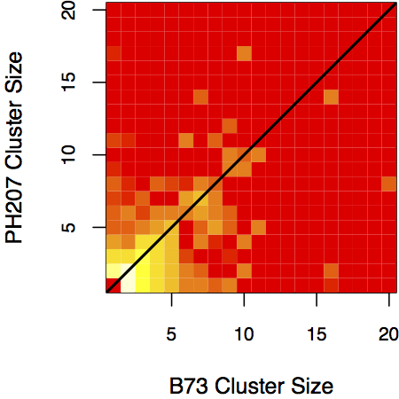

# Maize Tandem Duplicate Evolution
This document describes the detailed procedure that was taken for the various
maize tandem duplicate evolution analyses and data handling.

## Overview
The general categories of the analysis fall into four categories:

- Tandem duplicate identification
- Tandem duplicate summaries
- Divergence date estimation
- Evolutionary hypothesis tests

They will be detailed in the following sections. Commands and scripts will be
given. At the end of the report, there is a listing of the key analysis files,
and a description of their contents.

## Tandem Duplicate Identification
Tandem duplicates were identified in two ways:

- Filtering SynMap tandem duplicate output
- Sequence similarity of adjacent genes

SynMap identifies tandem duplicates in a slightly strange way: different genes
within a window that have BLAST hits to the same gene in the other genome. It
does not explicitly check sequence similarity of genes within the same genome,
so there is no guarantee that they are true tandem duplicates. It also
identifies tandem duplicates before it clusters BLAST matches into syntenic
blocks, so there will be nonsyntenic duplications identifed this way.

To refine the SynMap clusters and identify additional tandem duplicates, we
calculated an adjusted pairwise similarity metric for each pair of adjacent
genes in B73v4 and PH207v1. Adjusted pairwise simiarity is pairwise similarity,
down-weighted for the number of gaps opened in alignment of the two sequences.
The procedure for calculating this was as follows:

For each pair of adjacent genes:

1. Translate the CDS of the longest transcripts into amino acids.
2. Align them with ClustalOmega, with 10 iterations of refinement.
3. Back-translate the amino acid alignment into nucleotides.
4. Calculate the proportion of gaps and pairwise similarity (1 - `ThetaPi`)
   with `compute` from the `analysis` package. `compute` can interpret shell
   globbing characters (need to be in single quotes):

    ```bash
    compute -i '*.fasta' > Genomewide_Stats.txt
    ```

5. Calculate adjusted pairwise similarity as `(1 - ThetaPi) * (nsites_ug/nsites)`

This procedure was performed for both B73 and PH207. We ran it on both all
adjacent genes genome-wide, and for pairs of genes within SynMap putative
tandem duplicate clusters.

The alignment is implemented in `Scripts/Analysis/Adjacent_Gene_Similarity.py`,
and the plotting is in `Scripts/Plotting/Tandem_Adjusted_Similarity.R`.

A distribution of adjusted pairwise similarity for adjacent B73 genes, adjacent
PH207 genes, B73 putative tandem genes, and PH207 putative tandem genes is
shown below.


Based on this plot, putative tandem duplicate genes from SynMap and adjacent
genes with at least 0.3 adjusted similarity were kept as true tandem duplicates.

The tandem duplicate clusters were generated with the
`Scripts/Analysis/Generate_Tandem_Clusters.py` script:

```bash
python Scripts/Analysis/Generate_Tandem_Clusters.py \
    B73_Tandem_Alignment_Stats.txt \
    B73_Genomewide_Stats.txt > B73_True_Tandem_Clusters.txt
```

Run the same for PH207.

## Tandem Duplicate Summaries
### Counts of Tandem Duplicate Clusters
The first summary of tandem duplicates is a raw count:

| Genotype | Maize1 Clusters | Maize2 Clusters | Nonsyntenic Clusters | Total |
|----------|-----------------|-----------------|----------------------|-------|
| B73      | 938             | 420             | 276*                 | 1,758 |
| PH207    | 691             | 316             | 248*                 | 1,467 |

*: Sometimes there are nonsyntenic clusters that are homologous to syntenic
clusters. They are excluded from the syntenic/nonsyntenic cluster assignments,
because they cannot be unambiguously assigned.

Tandem duplicate clusters were assigned into syntenic and nonsyntenic categories
based on information in the gene key and the syntenic master table generated by
ABB. The script to classify them is
`Scripts/Analysis/Generate_Tandem_Cluster_Assignments.py`. It also generates
alignments of the syntenic and nonsyntenic duplicates:

```bash
python Generate_Tandem_Cluster_Alignments.py \
    Syntenic_Cluster_Assignments.txt \
    Nonsyntenic_Cluster_Assignments.txt \
    Syntenic_Dups/ \
    Nonsyntenic_Dups/
```

The alignments are back-translated alignments of the amino acid sequencs from
the longest transcript of each gene. We need nucleotide alignments to estimate
substitution rates. The syntenic alignments contain the ancestral gene,
B1 genes, B2 genes, P1 genes, P2 genes, and any maize tandem duplicates that
contain those syntenic genes. The nonsyntenic alignments only contain homologous
B73 and PH207 genes and their tandem duplicates. These alignments will be used
for the date analysis.

### Tandem Duplicates Across the Genome
Next, we wanted to generate a plot of the distribution of tandem duplicates
relative to other genomic features, such as subgenome assignment, gene density,
and TE density. To do this, we need to generate files that give the densities
of these genomic features in windows across the genome:

```bash
python B73_DNA_TE_Gene_Density.py \
    B73_Genes.gff \
    B73_DNA_TE.gff \
    B73_RNA_TE.gff \
    B73_genome.fa.fai > B73_Genomic_Densities.txt
```

We also need to make a GFF that has the positions of the tandemly duplicated
genes:

```bash
cut -f 2 B73_True_Tandem_Clusters.txt | tr ',' '\n' > B_tandem_genes.txt
grep -f B_tandem_genes.txt B73_Genes.gff > B_tandem_genes.gff
```
Then, plot the data with `Scripts/Plotting/B73_Chr2_Plot.R`. Edit the scipt to
potint to the syntenic blocks assignments from ABB, the tandem gene GFF, and the
genomic feature density file. An example for chromosome 2 is shown below:


The top panel shows B73 Chr2, and the bottom panel shows PH207 Chr2. The green
shading is maize1, and the blue shading is maize2. Purple tick marks are
tandem duplicate genes. The black line shows genes per Mb, the red line shows
RNA TEs per Mb, and the orange line shows DNA TEs per MB. Structural annotation
for the TEs in PH207 is not yet available.

It looks like tandem duplications occur where there are genes. That is, it does
not seem like tandem duplications are more common in one subgenome than the
other, nor do they enriched outside of syntenic blocks or around any broad class
of transposable elements.

### Tandem Duplicate Homology
The next summary we want to make relates to the homology of tandem duplicate
clusters between B73 and PH207. To do this, we use homology assignments for
genes between B73 and PH207, and ask if they are duplicated in B73 or PH207.
This is implemented in 
`Scripts/Data_Handling/Identify_Homolgous_Tandems_wSynteny.py`. The first
argument is a file generated by ABB that lists the Ancestral, B1, B2, P1, and P2
genes.

```bash
python Scripts/Data_Handling/Identify_Homologous_Tandems_wSynteny.py \
    b73-ph207-synteny-bt2corrected-nah-coord.txt \
    B73_True_Tandem_Clusters.txt \
    PH207_True_Tandem_Clusters.txt > B_P_Homologous_Tandems.txt
```

Then, plot with `Scripts/Plotting/Tandem_Homology.R`. A heatmap of the
homologous cluster sizes is shown below:



There is substantial off-diagonal heat, but it still seems like most of the
time, when a gene is in a tandem duplicate cluster in one genotype, it is in a
cluster of similar size in the other genotype.

### Association of Tandem Duplicates With Genomic Features
We want to ask if genomic features such as subgenome assignment or TE density
explain variation for tandem duplicate density. To do this, we fit several
linear models. Note that this can only be done for B73 for now.

Make a data table that will be analyzed with linear models. We take the genome
and break it into 1Mb non-overlapping windows. For each window, get the number
of annotated genes, number of RNA TEs, number of DNA TEs, and the majority
subgenome assignment. This is implemented in 
`Scripts/Data_Handling/Make_Tandem_Location_Table.py`

```bash
python Scripts/Data_Handling/Make_Tandem_Location_Table.py \
    Results/Filtering/B73_True_Tandem_Clusters.txt \
    Data/References/B73_Genes_Sorted.gff \
    Data/References/B73v4_structural_filtered_newTIRID_detectMITE_noSINEdup.Feb92017.noDepreciatedSolos.gff3 \
    Data/ABB_Synteny/b73-syntenic-blocks-merged.txt \
    > Results/Filtering/Tandem_Genomic_Features.txt
```

## Divergence Date Estimation
Divergence dates were estimated with BEAST. We used the alignments generated by
the `Scripts/Analysis/Syntenic_Tandem_Cluster_Align_withSingles.py` script (and
its nonsyntenic counterpart). Because BEAST is a gene-by-gene program that uses
an XML control file, we need to generate a separate XML file for each tandem
duplicate that we want to analyze. The script to do this is
`Scripts/Data_Handling/Generate_BEAST_XML.py`:

```bash
mkdir Syntenic_BEAST_XML
cd Syn_out
for i in $(*.fasta)
do
    python Generate_BEAST_XML.py ${i} > ../Syntenic_BEAST_XML/${i/.fasta/.xml}
done
```

The same was done for the nonsyntenic duplicates. Note that for these analyses,
the homologous B73 and PH207 tandem duplicate clusters were combined into the
same alignment.

The XML file specifies the parameters of the BEAST analysis. The parameters were
chosen by analyzing several tandem clusters by hand, and adjusting the paramters
to improve the model fit. We chose the following parameters:

- GTR+Gamma nucleotide substitution model
- Estimate the transition probabilities and equilibrium base frequencies
- Random local clock to allow for rate variation among branches
- Prior on maize1-maize2 divergence is ~N(11.9, 1) and monophyletic
- 10,000,000 MCMC steps

BEAST was then run on the MSI servers, using the `Scripts/Job_Scripts/BEAST.job`
script.

Output trees were annotated with time to most recent common ancestry (TMRCA,
"node height") and variances for each estimate with the `TreeAnnotator`
program, pacakged with BEAST. Annotation was done on the MSI servers with
the `Scripts/Job_Scripts/TreeAnnotator.job` script.

The directory of trees was downloaded and parsed locally to obtain distributions
of estimated duplication times. Note that trees need to be edited slightly
before dates can be parsed from them. Specifically, the '&' characters need to
be removed from the node labels, because these cause a Biopython parse error.
The `Scripts/Analysis/Syntenic_Tandem_Ages.py` and
`Scripts/Analysis/Nonsyntenic_Tandem_Ages.py` will parse the annotated trees
from syntenic duplications and nonsyntenic duplications and print the ages:

```bash
cd Syn_Annotated_Trees/
for i in *_Ann.tree; do sed -i.bak -e 's/&//g' ${i}; done
cd ../Nonsyn_Annotated_Trees/
for i in *_Ann.tree; do sed -i.bak -e 's/&//g' ${i}; done
cd ../
python Syntenic_Tandem_Ages.py Syn_Annotated_Trees/ > Syntenic_Duplicate_Ages.txt
python Nonsyntenic_Tandem_Ages.py Nonsyn_Annotated_Trees/ > Nonsyntenic_Duplicate_Ages.txt
```

The dates were estimated by finding the time to common ancestry for adjacent
genes within tandem duplicate clusters. While it would be best to know the
number of duplication events, this information is impossible to know. There
must be at most the number of genes - 1 total duplication events, however. In
the ages files generated by the commands above, the ages are reported for
neighboring tandem duplicates. For example:

```
Gen1,Gene2,Gene3    Age1,Age2
```

means that the TMRCA for Gene1 and Gene2 is Age1, and the TMRCA of Gene2 and
Gene3 is Age2.

When a duplication is shared between B73 and PH207, we assume that dates that
match exactly between the two genotypes represent one duplication event that
predates the divergence of the genotypes. This may not necessary be a correct
assumption, because gene duplications likely do not follow the infinite sites
mutation model. I.e., duplications can (and do) happen multiple times at the
same locus, and identity by state is not necessarily identity by descent. We
move foward knowing this limitation.

We also assume that the genes within a tandem duplication are evoloving along
truly separate trajectories. That is, we assume that the genes are truly
divergent, and there is not recombination among them. We know that gene
conversion does happen between genes in tandem arrays, however. This may bias
our results to make duplications look younger than they actually are, because
it would generate more similar sequences than without gene conversion. Knowing
this, too, we continue.

A distribution of the estimated divergence times is showen below:


Duplications that are shared between B73 Maize1 and PH207 Maize1 are shown in
solid green. Duplications that are shared between B73 Maize2 and PH207 Maize2
are shown in solid blue. Duplications that are private to B73 Maize1 or PH207
Maize1 are shown in dashed green. Duplications that are private to B73 Maize2
or PH207 Maize2 are shown in dashed blue. Nonsyntenic duplications are shown in
solid red.

As expected, duplications that are shared between the subgenomes tend to be
older than duplications that are pricate to a subgenome. Nonsyntenic tandem
duplicates show a high proportion of recent duplicates.

### GC Content of Tandem Duplicates
One way to see if gene conversion is having an effect on the estimated dates
of tandem duplications is to compare the GC content of tandem duplicates that
are "ancient" and those that are "recent." Gene conversion is biased toward GC
rich regions. If duplications that look new tend to have high GC content, then
it is plausible that gene conversion is affecting our estimates of duplication
dates.

GC content for the longest transcripts of each annotated gene were calculated
with `Scripts/Analysis/Gene_GC_Content.py`:

```bash
python Scripts/Analysis/Gene_GC_Content.py B73_Longest_Nuc.fasta > B73_Genes_GC_Prop.txt
python Scripts/Analysis/Gene_GC_Content.py PH207_Longest_Nuc.fasta > PH207_Genes_GC_Prop.txt
```

Then, a table listing genes involved with tandem duplications, the estimated
duplication age, and the GC content of the genes was generated with
`Scripts/Analysis/Tandem_Duplicate_GC.py`:

```bash
python Scripts/Analysis/Tandem_Duplicate_GC.py \
    Results/Dating/Syntenic_Duplicate_Ages.txt \
    Results/Dating/Nonsyntenic_Duplicate_Ages.txt \
    B73_Genes_GC_Prop.txt \
    PH207_Genes_GC_Prop.txt > Tandem_Dates_with_GC.txt
```

A summary plot of GC contents for B73 genes, PH207 genes, and tandem duplicate
genes is shown below:


Tandem duplicates, particularly syntenic tandem duplicates, have much higher
GC content than genes genome-wide.

When linking tandem duplicate age and GC content, it does not appear as though
there is a difference between "ancient" and "recent" duplications:


## Evolutionary Hypothesis Tests
We are interested in whether tandem duplicates show different evolutionary rates
than non-tandem genes in maize. To test this, we compare sequence substitution
rates among maize tandem duplications, maize genes generally, and grass
orthologues.

### Identifying Grass Orthologues
We identified orthologues among publicly available grass genomes from
Phytozome V12 and Ensembl Plants V34 with Orthofinder. The amino acid sequences
from the following genome assmeblies were used as input:

| Species                   | Assembly Ver. | Anno. Ver. | Source            |
|---------------------------|---------------|------------|-------------------|
| *Aegilops tauschii*       | ASM34733v1    | ASM34733v1 | Ensembl Plants 34 |
| *Brachypodium distachyon* | 3.1           | 3.1        | Phytozome V12     |
| *Hordeum vulgare*         | ASM32608v1    | ASM32608v1 | Ensembl Plants 34 |
| *Leersia perrieri*        | Lperr_V1.4    | Lperr_V1.4 | Ensembl Plants 34 |
| *Oropetium thomaeum*      | 1.0           | 1.0        | Phytozome V12     |
| *Oryza sativa*            | IRGSP-1.0     | IRGSP-1.0  | Ensembl Plants 34 |
| *Panicum hallii*          | 2.0           | 2.0        | Phytozome V12     |
| *Panicum virgatum*        | 1.1           | 1.1        | Phytozome V12     |
| *Phyllostachys edulis*    | 1.0           | 1.0        | BambooGDB         |
| *Setaria italica*         | 2.2           | 2.2        | Phytozome V12     |
| *Sorghum bicolor*         | 3.1           | 3.1        | Phytozome V12     |
| *Triticum aestivum*       | TGACv1        | TGACv1     | Ensembl Plants 34 |
| *Triticum urartu*         | ASM34745v1    | ASM34745v1 | Ensembl Plants 34 |

Orthofinder was run with the default 'dendroblast' orthologue search method,
and default parameters for MCL clustering. Amino acid sequences from B73 and
PH207 were kept in separate files. Be sure to download both the amino acid
sequences and the nucleotide sequences. The amino acids sequences will be used
to identify orthologues, and the nucleotide sequences will be used in alignment
and tree building. The amino acid files are saved in `Ortho_Base` and the
nucleotide files are saved in `Ortho_Nuc`.

Orthologue searching was run on MSI, and the job file is given in
`Scripts/Jobs/Orthofinder.job`.

### Generating Trees
The next step in generating the input files is to generate nucleotide sequence
alignments and phylogenetic trees that relate the sequences in each orthologous
group. Because Orthofidner uses a modification of BLAST scores, it does not
produce any alignments nor trees. We must do this on our own.

First, retrieve the sequences that are part of each orthogroup. We use the CSV
orthogroup output file, and the directory of amino acid input files for
Orthofinder. The `Scripts/Data_Handling/Generate_Orthogroup_Seqs.py` script
will do this:

```bash
mkdir Orthogroup_Seqs/
python Scripts/Data_Handling/Generate_Orthogroup_Seqs.py \
    Orthogroups.csv.gz \
    /path/to/Ortho_Base/ \
    Orthogroup_Seqs/
```

Note that this script requires `samtools` to be available, because it uses
`samtools faidx` to retrieve sequences from the amino acid FASTA files.

Then, we align each orthogroup with ClustalOmega:

```bash
mkdir Aligned/
cd Orthogroup_Seqs/
for i in *.fa
do
    clustalo -v -i ${i} -t Protein --full-iter --iter=10 --out ../Aligned/${i/.fa/_Aligned.fa}
done
```

This can take a long time, so we do it on MSI.

Then, the orthogroup alignments need to be backtranslated from amino acids to
nucleotides. The script `Scripts/Data_Handling/Backtranslate_Orthogroup.py`
will do this:

```bash
mkdir Backtranslated/
cd Aligned/
for i in *Aligned.fa
do
    python Backtranslate_Orthogroup.py /path/to/Ortho_Nuc ${i} > ../Backtranslated/${i/_Aligned/_Backtranslated}
done
```

This step is relatively fast.

Then, we filter orthogroup alignments. We remove sites with more than 25%
missing data, and remove any sequences that are all gaps after site filtering.
This is implemented in `Scripts/Data_Handling/OG_Site_Filter.py`:

```bash
cd Backtranslated/
mkdir ../25gap_FLT/
for i in *.fa
do
    python OG_Site_Filter.py ${i} 0.25 > ../25gap_FLT/${i/.fa/_25Flt.fa}
done
```

Finally, we use RAxML to estimate a tree of the sequences in the aligned and
backtranslated orthogroup. We use the following parameters:

- Default rapid hill-climbing search algorithm (`-f d`)
- GTR+Gamma nucleotide substitution model (`-m GTRGAMMAX`)

```bash
mkdir Trees/
cd 25gap_FLT/
for i in *25FLT.fa
do
    raxml -f d -m GTRGAMMAX -n ${i/_25FLT.fa/} -s ${i} -p 123 -w /full/path/to/Trees
done
```

### CodeML (PAML) Tests
Prior to running evolutionary tests on tandem duplicates, we want to filter the
orthogroups. Orthogroups that are very large likely represent big gene families,
and are likely not representative of tandem duplicates genome-wide. Orthogroups
that are very small may not have enough evolutionary history sampled to test
whether or not tandem duplicates have a significantly different substitution
rate than other genes.

Plotted is a distribution of sizes for orthogroups that contain maize tandem
duplicate genes:


The shaded area contains orthogroups with between 10 and 75 genes. These will
be used for PAML tests. There are 1,630 orthogroups in this size range.

Further, we are only interested in testing the evolutionary trajectories of
new duplications. The rationale for this is that if a duplication has been
retained since the divergence of maize from the common ancestor of maize and
*Sorghum*, it is likely not going to be very different from maize genes,
generally.

We further filter the list of orthogroups to analyze to those that contain
duplications that are private to B73 maize1, B73 maize2, PH207 maize1, or PH207
maize2. The tandem duplications must not be "split" across multiple orthogroups.
A total of 123 orthogroups match these criteria.

Each orthogroup has a total of four evolutionary models appled to it. They are
described as follows:

- Null: All branches evolve at the same rate (same omega).
- Ha1: Maize genes (including tandems) evolve at a different rate from grass
  orthologues
- Ha2: Maize tandems evolve at a different rate from grass orthologues and other
  maize genes. Grass orthologues and maize non-tandems evolve at the same rate.
- Ha3: Maize tandems evolve at a different rate from maize non-tandems, and
  maize non-tandems evolve at a different rate from grass orthologues.

Each model will be fit to the alignments and trees with the `codeml` program
from PAML.

#### Marking Trees
Trees are marked according to the four models described above. Each model gets
its own marked tree:

- Null: No marks (all branches are implied `#0`)
- Ha1: Maize genes, and internal nodes that are common ancestors of only maize
  genes are marked as foreground (`#1`). All other nodes are left unmarked.
- Ha2: Maize tandems, and internal nodes that are common ancestors of only maize
  tandems are marked as foreground. All other nodes are left unmarked.
- Ha3: Maize tandems, and internal nodes that are common ancestors of only maize
  tandems are marked as `#1`. Maize non-tandems and common ancestors of only
  maize non-tandems are marked as `#2`. All other nodes are left unmarked.

The script for marking the trees is
`Scripts/Data_Handling/Mark_Trees_For_CodeML.py`. Note that it must be run with
a Python installation that has `ete3` available. This is usually different from
the system default Python installation, because ETE recommends installation
throgh the Conda framework. This script will also generate a CodeML control
file for running the codon models.

Before the models are run, though, the names in the alignment and the tree need
to be shortened. PAML cannot read sequence names that are longer than 50
characters. We replace the full species names with abbreviated forms, listed
in `Scripts/Data_Handling/Shorten_Species.sed`:

```sed
# Shorten species names for PAML
s/Aegilops_tauschii/Ata/g
s/Brachypodium_distachyon/Bdi/g
s/Hordeum_vulgare/Hvu/g
s/Leersia_perrieri/Lpe/g
s/Oropetium_thomaeum/Oth/g
s/Oryza_sativa/Osa/g
s/Panicum_hallii/Pha/g
s/Panicum_virgatum/Pvi/g
s/Setaria_italica/Sit/g
s/Sorghum_bicolor/Sbi/g
s/Triticum_aestivum/Tae/g
s/Triticum_urartu/Tur/g
```

The commands for generating the PAML control files and fixing the tree and
alignment names are written into `Scripts/Data_Handling/Setup_PAML_Files.sh`.
Edit the paths to the proper data files, then run the script:

```bash
bash Scripts/Data_Handling/Setup_PAML_Files.sh
```

The directory structure that will be generated by this script is as follows:

```
Orthogroup_ID/
Orthogroup_ID/Null/
Orthogroup_ID/Ha1/
Orthogroup_ID/Ha2/
Orthogroup_ID/Ha3/
```

with tree, alignment, and control files under each model directory. `codeml`
can then be run on each control file. This takes a long time; run it on the
compute cluster.

#### LRT For Model Comparison
The results from each PAML analysis is stored in the `rst` files that are found
in each of the model directories. We can extract the log-likelihood values from
these files, and compare the model fit with a series of likelihood ratio tests.
Use `Scripts/Data_Handling/Compile_PAML_lnL.py` to do this:

```
python Scripts/Data_Handling/Compile_PAML_lnL.py PAML_Tests/ > PAML_Results.txt
```

## Key Results Files

| Path                                                       | Description                                                                                      |
|------------------------------------------------------------|--------------------------------------------------------------------------------------------------|
| `Results/Divergence/B73_Genomewide_Stats.txt`              | `compute` summaries generated for all pairs of adjacent B73 genes, genome-wide                   |
| `Results/Divergence/B73_Tandem_Alignment_Stats.txt`        | `compute` summaries generated for all pairwise comparisons within CoGe tandem clusters for B73   |
| `Results/Divergence/PH207_Genomewide_Stats.txt`            | `compute` summaries generated for all pairs of adjacent PH207 genes, genome-wide                 |
| `Results/Divergence/PH207_Tandem_Alignment_Stats.txt`      | `compute` summaries generated for all pairwise comparisons within CoGe tandem clusters for PH207 |
| `Results/Filtering/B73_True_Tandem_Clusters.txt`           | B73 filtered tandem duplicate clusters                                                           |
| `Results/Filtering/PH207_True_Tandem_Clusters.txt`         | PH207 filtered tandem duplicate clusters                                                         |
| `Results/Filtering/Syntenic_Cluster_Assignments.txt`       | Lists clusters and duplicate genes in each subgenome                                             |
| `Results/Filtering/Nonsyntenic_Cluster_Assignments.txt`    | Lists clusters and duplicate genes that are homologous and in nonsyntenic positions              |
| `Results/Dating/Syntenic_Duplicate_Ages.txt`               | Estimated ages of syntenic tandem duplicates                                                     |
| `Results/Dating/Nonsyntenic_Duplicate_Ages.txt`            | Estimated ages of nonsyntenic tandem duplicates                                                  |
| `Results/Dating/Tandem_Dates_with_GC.txt`                  | GC contents of tandem duplicates and their estimated ages                                        |
| `Results/Orthofinder/Orthogroups_1.csv.gz`                 | All orthologous group relationships identified by Orthofinder                                    |
| `Results/Orthofinder/Tandem_Orthogroup_Assignments.txt.gz` | Gene-by-gene orthogroup and tandem duplicate status list for each gene in B73 and PH207          |
| `Results/Orthofinder/Orthogroup_Tandem_Gene_IDs.txt`       | The gene IDs for maize tandem duplicates within each orthogroup                                  |

## Software Versions and Environment
Analyses were perfomed on both MacOS X 10.12.6:

```
uname -a
Darwin C02SR6DZHF1R 16.7.0 Darwin Kernel Version 16.7.0: Thu Jun 15 17:36:27 PDT 2017; root:xnu-3789.70.16~2/RELEASE_X86_64 x86_64
```

and GNU/Linux:

```
uname -a
Linux ln0006 2.6.32-696.6.3.el6.x86_64 #1 SMP Wed Jul 12 14:17:22 UTC 2017 x86_64 x86_64 x86_64 GNU/Linux
```

The scripting language versions are

- Python 2.7.13
- R 3.4.1

Software tool versions:

- `analysis`: NA
- ClustalOmega 1.2.1
- SAMTools 1.4
- BEAST/TreeAnnotator 2.4.7
- Biopython 1.68
- Orthofinder 1.1.5
    - BLAST 2.5.0
    - MCL 14.137
- ETE Toolkit 3.0.0b36
- RAxML 8.2.11
- PAML 4.9e
