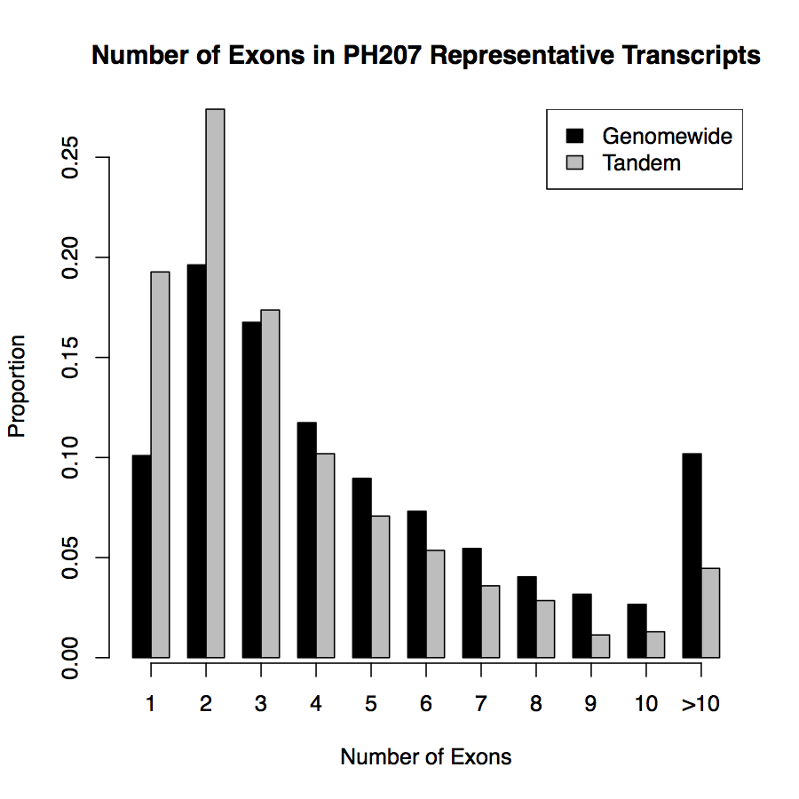
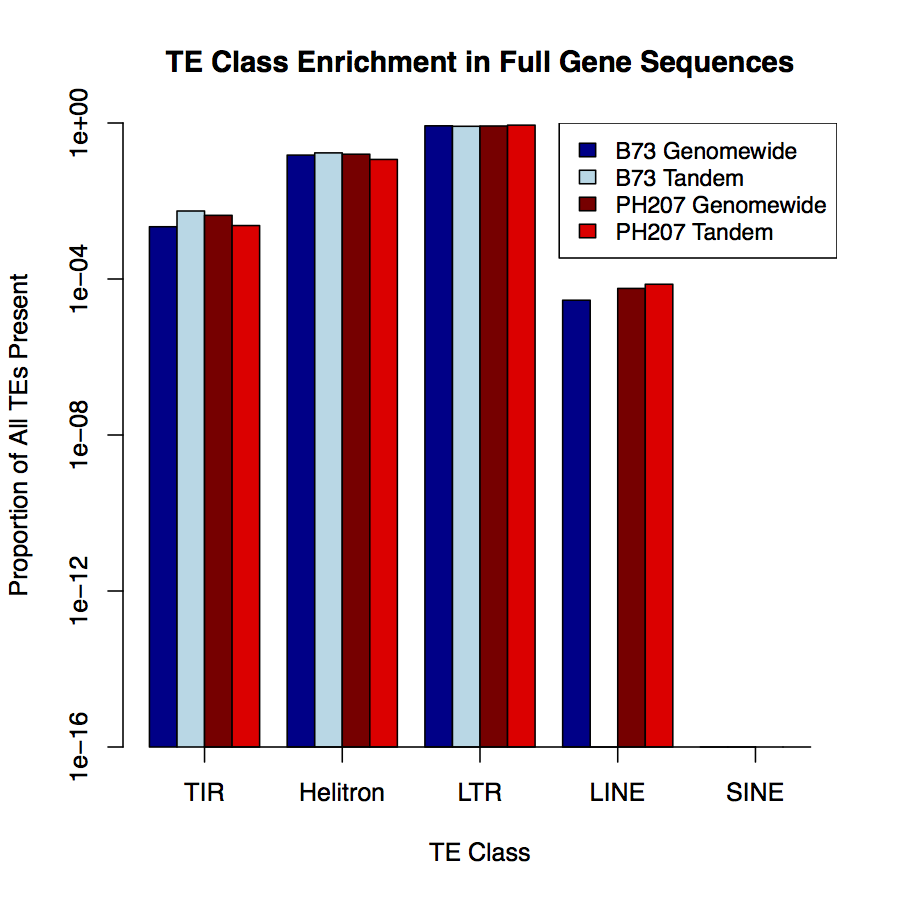
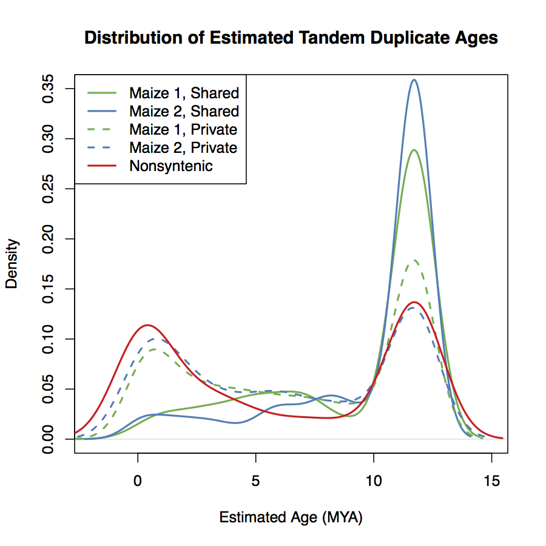

# <a name="top"></a>Maize Tandem Duplicate Evolution
This document describes the detailed procedure that was taken for the various
maize tandem duplicate evolution analyses and data handling.

[Return to top](#top)

## <a name="toc"></a>Table of Contents
- [Top](#top)
- [Table of Contents](#toc)
- [Overview](#overview)
- [Tandem Duplicate Identification](#identification)
- [Tandem Duplicate Summaries](#summaries)
    - [Counts of Tandem Duplicate Clusters](#counts)
    - [TE Sequence Similarity and Number of Exons](#nexons)
    - [Tandem Duplicates Across the Genome](#genome)
    - [Association of Tandem Duplicates with Genomic Features](#features)
    - [Distances from Tandem Duplicates to TEs](#tedist)
    - [Tandem Duplicate Homology](#homology)
- [Divergence Date Estimation](#dating)
    - [GC Content of Tandem Duplicates](#gc)
- [Evolutionary Hypothesis Tests](#evol)
    - [Identifying Grass Orthologues](#ortho)
        - [Orthofinder Setup](#ortho_setup)
    - [Generating Trees](#trees)
    - [CodeML (PAML) Tests](#codeml)
        - [Marking Trees](#marking)
        - [LRT For Model Comparison](#lrt)
- [Key Results Files](#key_res)
- [Software Versions and Environment](#env)

[Return to top](#top)
## <a name="overview"></a>Overview
The general categories of the analysis fall into four categories:

- Tandem duplicate identification
- Tandem duplicate summaries
- Divergence date estimation
- Evolutionary hypothesis tests

They will be detailed in the following sections. Commands and scripts will be
given. At the end of the report, there is a listing of the key analysis files,
and a description of their contents.

[Return to top](#top)
## <a name="identification"></a>Tandem Duplicate Identification
Tandem duplicates were identified in two ways:

- Filtering SynMap tandem duplicate output
- Sequence similarity of adjacent genes

SynMap identifies tandem duplicates in a slightly strange way: different genes
within a window that have BLAST hits to the same gene in the other genome. It
does not explicitly check sequence similarity of genes within the same genome,
so there is no guarantee that they are true tandem duplicates. It also
identifies tandem duplicates before it clusters BLAST matches into syntenic
blocks, so there will be nonsyntenic duplications identifed this way.

To refine the SynMap clusters and identify additional tandem duplicates, we
calculated an adjusted pairwise similarity metric for each pair of adjacent
genes in B73v4 and PH207v1. Adjusted pairwise simiarity is pairwise similarity,
down-weighted for the number of gaps opened in alignment of the two sequences.
The procedure for calculating this was as follows:

For each pair of adjacent genes:

1. Translate the CDS of the longest transcripts into amino acids.
2. Align them with ClustalOmega, with 10 iterations of refinement.
3. Back-translate the amino acid alignment into nucleotides.
4. Calculate the proportion of gaps and pairwise similarity (1 - `ThetaPi`)
   with `compute` from the `analysis` package.
5. Calculate adjusted pairwise similarity as `(1 - ThetaPi) * (nsites_ug/nsites)`

This procedure was performed for both B73 and PH207. We ran it on both all
adjacent genes genome-wide, and for pairs of genes within SynMap putative
tandem duplicate clusters.

The alignment is implemented in `Scripts/Analysis/Adjacent_Gene_Similarity.py`:

```bash
mkdir /scratch/B73_Adjacent
mkdir /scratch/PH207_Adjacent
python Scripts/Analysis/Adjacent_Gene_Similarity.py \
    Data/References/B73_Genes_Sorted.gff \
    Data/References/B73_Longest_Nuc.fasta \
    /scratch/B73_Adjacent
python Scripts/Analysis/Adjacent_Gene_Similarity.py \
    Data/References/PH207_Genes_Sorted.gff \
    Data/References/PH207_Longest_Nuc.fasta \
    /scratch/PH207_Adjacent
cd /scratch/B73_Adjacent
compute -i '*.fasta' > Results/Divergence/B73_Genomewide_Stats.txt
cd /scratch/PH207_Adjacent
compute -i '*.fasta' > Results/Divergence/PH207_Genomewide_Stats.txt
```

Take the same procedure for the tandem duplicates, using
`Scripts/Analysis/Tandem_Gene_Similarity.py`:

```bash
mkdir /scratch/B73_Tandem
mkdir /scratch/PH207_Tandem
python Scripts/Analysis/Tandem_Gene_Similarity.py \
    Data/B73v4vSb_tandem_duplicates.csv \
    Data/References/B73_Longest_Nuc.fasta \
    /scratch/B73_Tandem
python Scripts/Analysis/Tandem_Gene_Similarity.py \
    Data/PH207vSb_tandem_duplicates_geneid.csv \
    /Data/References/PH207_Longest_Nuc.fasta \
    /scratch/PH207_Tandem
cd /scratch/B73_Tandem
compute -i '*.fasta' > Results/Divergence/B73_Tandem_Alignment_Stats.txt
cd /scratch/PH207_Tandem
compute -i '*.fasta' > Results/Divergence/PH207_Tandem_Alignment_Stats.txt
```

A distribution of adjusted pairwise similarity for adjacent B73 genes, adjacent
PH207 genes, B73 putative tandem genes, and PH207 putative tandem genes is
shown below.


Based on this plot, putative tandem duplicate genes from SynMap and adjacent
genes with at least 0.3 adjusted similarity were kept as true tandem duplicates.

The tandem duplicate clusters were generated with the
`Scripts/Analysis/Generate_Tandem_Clusters.py` script:

```bash
python Scripts/Analysis/Generate_Tandem_Clusters.py \
    Results/Divergence/B73_Tandem_Alignment_Stats.txt \
    Results/Divergence/B73_Genomewide_Stats.txt \
    > Results/Filtering/B73_True_Tandem_Clusters.txt
python Scripts/Analysis/Generate_Tandem_Clusters.py \
    Results/Divergence/PH207_Tandem_Alignment_Stats.txt \
    Results/Divergence/PH207_Genomewide_Stats.txt \
    > Results/Filtering/PH207_True_Tandem_Clusters.txt
```

[Return to top](#top)
## <a name="summaries"></a>Tandem Duplicate Summaries
### <a name="counts"></a>Counts of Tandem Duplicate Clusters
The first summary of tandem duplicates is a raw count:

| Genotype | Maize1 Clusters | Maize2 Clusters | Nonsyntenic Clusters | Total |
|----------|-----------------|-----------------|----------------------|-------|
| B73      | 938             | 420             | 276*                 | 1,758 |
| PH207    | 691             | 316             | 248*                 | 1,467 |

*: Sometimes there are nonsyntenic clusters that are homologous to syntenic
clusters. They are excluded from the syntenic/nonsyntenic cluster assignments,
because they cannot be unambiguously assigned.

Tandem duplicate clusters were assigned into syntenic and nonsyntenic categories
based on information in the gene key and the syntenic master table generated by
ABB. The script to classify them is
`Scripts/Analysis/Generate_Tandem_Cluster_Assignments.py`. It also generates
alignments of the syntenic and nonsyntenic duplicates:

```bash
python Scripts/Analysis/Generate_Tandem_Cluster_Alignments.py \
    Results/Filtering/Syntenic_Cluster_Assignments.txt \
    Results/Filtering/Nonsyntenic_Cluster_Assignments.txt \
    /scratch/Syntenic_Dups/ \
    /scratch/Nonsyntenic_Dups/
```

The alignments are back-translated alignments of the amino acid sequencs from
the longest transcript of each gene. We need nucleotide alignments to estimate
substitution rates. The syntenic alignments contain the ancestral gene,
B1 genes, B2 genes, P1 genes, P2 genes, and any maize tandem duplicates that
contain those syntenic genes. The nonsyntenic alignments only contain homologous
B73 and PH207 genes and their tandem duplicates. These alignments will be used
for the date analysis.

[Return to top](#top)
### <a name="nexons"></a>TE Sequence Similarity and Number of Exons
To search the tandem duplicates for TE sequence similartiy and count the number
of exons, we need to generate a BLAST-searchable TE database and generate GFF
files with representative transcripts. The PH207 GFF file already has
representative transcripts listed. The B73 GFF file needs to be trimmed. We use
the longest transcript as a proxy for representative:

```bash
python Scripts/Data_Handling/Subset_GFF.py \
    Data/References/B73_Longest_Tx_ID.txt \
    /scratch/Zea_mays.AGPv4.33.gff5 \
    > B73_Rep_Transcript.gff
```

Make a BLAST-searchable database for the B73 TE sequences. We assume that the
TE sequences in B73 will be similar to the TE sequences in PH207:

```bash
mkdir /scratch/TE_DB
python Extract_Sequences_From_GFF.py \
    Data/References/B73v4_structural_filtered_newTIRID_detectMITE_noSINEdup.Feb92017.noDepreciatedSolos.gff3 \
    /scratch/Zea_mays.AGPv4.dna.genome.fa \
    > /scratch/TE_DB/B73v4_TEs.fasta
makeblastdb -in /scratch/TE_DB/B73v4_TEs.fasta -dbtype nucl -out /scratch/TE_DB/B73v4_TEs
```

Then, use `Scripts/Analysis/TE_Sim_NumExons.py` to search the database and count
the number of exons in the representative transcripts:

```bash
python Scripts/Analysis/TE_Sim_NumExons.py \
    Results/Filtering/B73_True_Tandem_Clusters.txt \
    Data/References/B73_Rep_Transcript.gff \
    Data/References/B73_Longest_Nuc.fasta.gz \
    /scratch/TE_DB/B73v4_TEs \
    > Results/TEs/B73_TE_NumExons.txt
python Scripts/Analysis/TE_Sim_NumExons.py \
    Results/Filtering/PH207_True_Tandem_Clusters.txt \
    Data/References/Zm-PH207-REFERENCE_NS-UIUC_UMN-1.0.gff3 \
    Data/References/PH207_Longest_Nuc.fasta.gz \
    /scratch/TE_DB/B73v4_TEs \
    > Results/TEs/PH207_TE_NumExons.txt
```

Also, generate values for all genes, genome-wide:

```bash
python Scripts/Analysis/Count_Repr_Exons.py \
    Data/References/B73_Rep_Transcript.gff \
    > Results/TEs/B73_Genomewide_NumExons.txt
python Scripts/Analysis/Count_Repr_Exons.py \
    Data/References/Zm-PH207-REFERENCE_NS-UIUC_UMN-1.0.gff3 \
    > Results/TEs/PH207_Genomewide_NumExons.txt
```

When searching just the coding sequence of the representative transcript against
the sequences of the B73 TE annotation, no tandem duplicate genes show any
sequence similarity to known TEs. The searches were performed with BLASTN,
requiring at least 25% query coverage, and an E-value of 1e-10 or less.

Tandem duplicate genes, however, do have fewer exons than genome-wide averages:

| Partition         | Mean | Median |
|-------------------|------|--------|
| B73 Tandem        | 3.4  | 2      |
| PH207 Tandem      | 3.7  | 3      |
| B73 Genome wide   | 5.2  | 4      |
| PH207 Genome wide | 5.1  | 3      |

Plots of mean number of exons are shown below:




Next, we searched for TE similarty among full annotated gene sequences for both
tandem duplicates and genomewide genes. Use the same script, but with the full
gene sequences instead:

```bash
# Extract full gene sequences
python Extract_Sequences_From_GFF.py \
    Data/References/B73_Genes_Sorted.gff \
    /scratch/Zea_mays.AGPv4.dna.genome.fa \
    > Data/References/B73_Full_Genes.fasta
python Extract_Sequences_From_GFF.py \
    Data/References/PH207_Genes_Sorted.gff \
    /scratch/Zm-PH207-REFERENCE_NS-UIUC_UMN-1.0.fasta \
    > Data/References/PH207_Full_Genes.fasta
# Search for tandem-TE similarity with full sequences
python Scripts/Analysis/TE_Sim_NumExons.py \
    Results/Filtering/B73_True_Tandem_Clusters.txt \
    Data/References/B73_Rep_Transcript.gff \
    Data/References/B73_Full_Genes.fasta \
    /scratch/TE_DB/B73v4_TEs \
    > Results/TEs/B73_FullGene_TE_NumExons.txt
python Scripts/Analysis/TE_Sim_NumExons.py \
    Results/Filtering/PH207_True_Tandem_Clusters.txt \
    Data/References/Zm-PH207-REFERENCE_NS-UIUC_UMN-1.0.gff3 \
    Data/References/PH207_Full_Genes.fasta \
    /scratch/TE_DB/B73v4_TEs \
    > Results/TEs/PH207_FullGene_TE_NumExons.txt
# Search for genomewide gene-TE similarity with full sequences
python Scripts/Analysis/TE_Sim_NumExons.py \
    Data/References/B73_Gene_IDs_Dummy.txt \
    Data/References/B73_Rep_Transcript.gff \
    Data/References/B73_Full_Genes.fasta \
    /scratch/TE_DB/B73v4_TEs \
    > Results/TEs/B73_FullGene_Genomewide_TE_NumExons.txt
python Scripts/Analysis/TE_Sim_NumExons.py \
    Data/References/PH207_Gene_IDs_Dummy \
    Data/References/Zm-PH207-REFERENCE_NS-UIUC_UMN-1.0.gff3 \
    Data/References/PH207_Full_Genes.fasta \
    /scratch/TE_DB/B73v4_TEs \
    > Results/TEs/PH207_FullGene_Genomewide_TE_NumExons.txt
```

Then, summarize the tables with `Scripts/Analysis/Count_TE_Types.py`:

```bash
python Scripts/Analysis/Count_TE_Types.py \
    Results/TEs/B73_FullGene_TE_NumExons.txt \
    Data/References/B73v4_structural_filtered_newTIRID_detectMITE_noSINEdup.Feb92017.noDepreciatedSolos.gff3 \
    > B73_FullGene_Tandem_TE_Summary.txt
python Scripts/Analysis/Count_TE_Types.py \
    Results/TEs/B73_FullGene_Genomewide_TE_NumExons.txt \
    Data/References/B73v4_structural_filtered_newTIRID_detectMITE_noSINEdup.Feb92017.noDepreciatedSolos.gff3 \
    > B73_FullGene_Genomewide_TE_Summary.txt
python Scripts/Analysis/Count_TE_Types.py \
    Results/TEs/PH207_FullGene_TE_NumExons.txt \
    Data/References/B73v4_structural_filtered_newTIRID_detectMITE_noSINEdup.Feb92017.noDepreciatedSolos.gff3 \
    > PH207_FullGene_Tandem_TE_Summary.txt
python Scripts/Analysis/Count_TE_Types.py \
    Results/TEs/PH207_FullGene_Genomewide_TE_NumExons.txt \
    Data/References/B73v4_structural_filtered_newTIRID_detectMITE_noSINEdup.Feb92017.noDepreciatedSolos.gff3 \
    > PH207_FullGene_Genomewide_TE_Summary.txt
```

When searching for TE sequence similarity in full gene sequences (including
introns and UTRs when available), LINEs do not show up at all in B73 tandem
duplicates, but do show up in PH207 tandem duplicates at genome-wide
proportions. SINE elements do not show up at all in genes.



[Return to top](#top)

### <a name="overlap"></a>Overlapping TEs and Tandem Duplicates
We are interested in genes that are "captured" by TEs, and TEs that insert into
genes. When a gene is "captured" by a TE, is it more likely to be a tandem
duplicate than not? When a TE inserts into a gene, is it more likely to be into
a tandemly duplicated gene? Use `bedtools` to calcuate overlaps between the gene
annotations and the TE annotations. Use the `-f 1` and `-F 1` options to
restrict the reports to just full overlaps. (If the overlap fraction is 1.0,
then the gene is fully contained with in the TE, or the TE is fully contained
within the gene)

```bash
# Find which genes are fully within TEs
bedtools intersect \
    -a Data/References/B73_Genes_Sorted.gff \
    -b Data/References/B73_LTR.gff -wo -f 1 \
    > Results/TEs/Overlaps/Genes_in_LTR.txt
bedtools intersect \
    -a Data/References/B73_Genes_Sorted.gff \
    -b Data/References/B73_LINE_element.gff -wo -f 1 \
    > Results/TEs/Overlaps/Genes_in_LINE.txt
bedtools intersect \
    -a Data/References/B73_Genes_Sorted.gff \
    -b Data/References/B73_SINE_element.gff -wo -f 1 \
    > Results/TEs/Overlaps/Genes_in_SINE.txt
bedtools intersect \
    -a Data/References/B73_Genes_Sorted.gff \
    -b Data/References/B73_terminal_inverted_repeat_element.gff -wo -f 1 \
    > Results/TEs/Overlaps/Genes_in_TIR.txt
bedtools intersect \
    -a Data/References/B73_Genes_Sorted.gff \
    -b Data/References/B73_helitron.gff -wo -f 1 \
    > Results/TEs/Overlaps/Genes_in_Helitron.txt
# Find which TEs are fully within genes
bedtools intersect \
    -a Data/References/B73_Genes_Sorted.gff \
    -b Data/References/B73_LTR.gff -wo -F 1 \
    > Results/TEs/LTR_in_Genes.txt
bedtools intersect \
    -a Data/References/B73_Genes_Sorted.gff \
    -b Data/References/B73_LINE_element.gff -wo -F 1 \
    > Results/TEs/LINE_in_Genes.txt
bedtools intersect \
    -a Data/References/B73_Genes_Sorted.gff \
    -b Data/References/B73_SINE_element.gff -wo -F 1 \
    > Results/TEs/SINE_in_Genes.txt
bedtools intersect \
    -a Data/References/B73_Genes_Sorted.gff \
    -b Data/References/B73_terminal_inverted_repeat_element.gff -wo -F 1 \
    > Results/TEs/TIR_in_Genes.txt
bedtools intersect \
    -a Data/References/B73_Genes_Sorted.gff \
    -b Data/References/B73_helitron.gff -wo -F 1 \
    > Results/TEs/Helitron_in_Genes.txt
```

### <a name="genome"></a>Tandem Duplicates Across the Genome
Next, we wanted to generate a plot of the distribution of tandem duplicates
relative to other genomic features, such as subgenome assignment, gene density,
and TE density. To do this, we need to generate files that give the densities
of these genomic features in windows across the genome:

```bash
awk '$3 == "LINE_element" || $3 == "LTR_retrotransposon" || $3 == "solo_LTR" || $3 == "SINE_element" {print}' \
    Data/References/B73v4_structural_filtered_newTIRID_detectMITE_noSINEdup.Feb92017.noDepreciatedSolos.gff3 \
    > Data/References/B73_RNA_TEs.gff
awk '$3 == "helitron" || $3 == "terminal_inverted_repeat_element" {print}' \
    Data/References/B73v4_structural_filtered_newTIRID_detectMITE_noSINEdup.Feb92017.noDepreciatedSolos.gff3 \
    > Data/References/B73_DNA_TEs.gff
python Scripts/Analysis/B73_DNA_TE_Gene_Density.py \
    Data/References/B73_Genes_Sorted.gff \
    Data/References/B73_DNA_TEs.gff \
    Data/References/B73_RNA_TEs.gff \
    Data/References/B73_genome.fa.fai \
    > Data/B73_GeneDensity_TEDensity.txt
```

We also need to make a GFF that has the positions of the tandemly duplicated
genes:

```bash
cut -f 2 Results/Filtering/B73_True_Tandem_Clusters.txt \
    | tr ',' '\n' \
    > /scratch/B_tandem_genes.txt
grep -f /scratch/B_tandem_genes.txt Data/Results/B73_Genes_Sorted.gff \
    > Data/References/B73_True_Tandem_Positions.gff
```

Then, plot the data with `Scripts/Plotting/B73_Chr2_Plot.R`. Edit the scipt to
potint to the syntenic blocks assignments from ABB, the tandem gene GFF, and the
genomic feature density file. An example for chromosome 2 is shown below:


The top panel shows B73 Chr2, and the bottom panel shows PH207 Chr2. The green
shading is maize1, and the blue shading is maize2. Purple tick marks are
tandem duplicate genes. The black line shows genes per Mb, the red line shows
RNA TEs per Mb, and the orange line shows DNA TEs per MB. Structural annotation
for the TEs in PH207 is not yet available.

[Return to top](#top)
### <a name="features"></a>Association of Tandem Duplicates With Genomic Features
It looks like tandem duplications occur where there are genes. That is, it does
not seem like tandem duplications are more common in one subgenome than the
other, nor do they enriched outside of syntenic blocks or around any broad class
of transposable elements.

To test this, we make a data table that has the following values for 1Mb windows
across the B73v4 genome:

- Proportion of bases in genes
- Proportion of bases in tandem duplicates
- Proportion of bases in RNA TEs
- Proportion of bases in DNA TEs
- Majority subgenome assignment

`Scripts/Data_Handling/Generate_Genome_Intervals.py` will generate a BED file
with non-overlapping windows of a specified size:

```bash
python Scripts/Data_Handling/Generate_Genome_Intervals.py 1000000 \
    > Data/References/B73_1Mb_Windows.bed
```

Generate BED files for the maize1 and maize2 syntenic blocks:

```bash
grep 'maize1' Data/ABB_Synteny/b73-syntenic-blocks-merged.txt \
    | cut -f 1-3 \
    > Data/ABB_Synteny/B73_Maize1.bed
grep 'maize2' Data/ABB_Synteny/b73-syntenic-blocks-merged.txt \
    | cut -f 1-3 \
    > Data/ABB_Synteny/B73_Maize2.bed
```

`bedtools` will calculate the fraction of interval overlap. Run it on all the
intervals files:

```bash
bedtools coverage \
    -a Data/References/B73_1Mb_Windows.bed \
    -b Data/References/B73_Genes_Sorted.gff \
    > Results/Tandem_Locations/Prop_Coding.txt
bedtools coverage \
    -a Data/References/B73_1Mb_Windows.bed \
    -b Data/References/B73_True_Tandem_Positions.gff \
    > Results/Tandem_Locations/Prop_Tandem.txt
bedtools coverage \
    -a Data/References/B73_1Mb_Windows.bed \
    -b Data/References/B73_RNA_TEs.gff \
    > Results/Tandem_Locations/Prop_RNA.txt
bedtools coverage \
    -a Data/References/B73_1Mb_Windows.bed \
    -b Data/References/B73_DNA_TEs.gff \
    > Results/Tandem_Locations/Prop_DNA.txt
bedtools coverage \
    -a Data/References/B73_1Mb_Windows.bed \
    -b Data/ABB_Synteny/B73_Maize1.bed \
    > Results/Tandem_Locations/Prop_M1.txt
bedtools coverage \
    -a Data/References/B73_1Mb_Windows.bed \
    -b Data/ABB_Synteny/B73_Maize2.bed \
    > Results/Tandem_Locations/Prop_M2.txt
```

`Scripts/Data_Handling/Make_Tandem_Location_Table.py` will compile the overlap
files and produce a table that can be analyzed with linear models:

```bash
python Scripts/Data_Handling/Make_Tandem_Location_Table.py \
    Results/Tandem_Locations/Prop_Coding.txt \
    Results/Tandem_Locations/Prop_Tandem.txt \
    Results/Tandem_Locations/Prop_RNA.txt \
    Results/Tandem_Locations/Prop_DNA.txt \
    Results/Tandem_Locations/Prop_M1.txt \
    Results/Tandem_Locations/Prop_M2.txt \
    > Results/Tandem_Locations/Tandem_Location_Summary.txt
```

It looks like maize subgenome2 has significantly fewer tandem duplicates than
maize subgenome1 or nonsyntenic regions. As expected, tandem duplicate density
is most strongly associated with gene density. The output from model fitting in
R is shown below.

There is no evidence for a significant effect of an interaction effect of
gene density and subgenome:

```
Analysis of Deviance Table

Model 1: dat$Prop_Tandem ~ dat$Prop_Genes + dat$Prop_RNATE + dat$Prop_DNATE +
    dat$Subgenome
Model 2: dat$Prop_Tandem ~ dat$Prop_Genes * dat$Subgenome + dat$Prop_RNATE +
    dat$Prop_DNATE
  Resid. Df Resid. Dev Df   Deviance
1      2105    0.18279
2      2103    0.18258  2 0.00021061
```

Summary of model with only main effects:

```
Call:
glm(formula = dat$Prop_Tandem ~ dat$Prop_Genes + dat$Prop_RNATE +
    dat$Prop_DNATE + dat$Subgenome)

Deviance Residuals:
      Min         1Q     Median         3Q        Max
-0.015198  -0.005041  -0.002360   0.001791   0.094179

Coefficients:
                           Estimate Std. Error t value Pr(>|t|)
(Intercept)              -0.0051275  0.0022762  -2.253 0.024384
dat$Prop_Genes            0.0733802  0.0051058  14.372  < 2e-16
dat$Prop_RNATE            0.0064295  0.0030330   2.120 0.034134
dat$Prop_DNATE            0.0097906  0.0045333   2.160 0.030909
dat$SubgenomeMaize2      -0.0017345  0.0004468  -3.882 0.000107
dat$SubgenomeNonsyntenic -0.0007172  0.0006776  -1.058 0.289978

(Dispersion parameter for gaussian family taken to be 8.683701e-05)

    Null deviance: 0.20807  on 2110  degrees of freedom
Residual deviance: 0.18279  on 2105  degrees of freedom
AIC: -13742

Number of Fisher Scoring iterations: 2
```

Summary of model with an interaction between subgenome and gene density:

```
Call:
glm(formula = dat$Prop_Tandem ~ dat$Prop_Genes * dat$Subgenome +
    dat$Prop_RNATE + dat$Prop_DNATE)

Deviance Residuals:
      Min         1Q     Median         3Q        Max
-0.016006  -0.004997  -0.002385   0.001864   0.093700

Coefficients:
                                          Estimate Std. Error t value Pr(>|t|)
(Intercept)                             -0.0056322  0.0022989  -2.450   0.0144
dat$Prop_Genes                           0.0795582  0.0064818  12.274   <2e-16
dat$SubgenomeMaize2                     -0.0006711  0.0008676  -0.774   0.4393
dat$SubgenomeNonsyntenic                 0.0002263  0.0011280   0.201   0.8410
dat$Prop_RNATE                           0.0064808  0.0030329   2.137   0.0327
dat$Prop_DNATE                           0.0097215  0.0045359   2.143   0.0322
dat$Prop_Genes:dat$SubgenomeMaize2      -0.0132485  0.0092422  -1.433   0.1519
dat$Prop_Genes:dat$SubgenomeNonsyntenic -0.0167071  0.0188962  -0.884   0.3767

    Null deviance: 0.20807  on 2110  degrees of freedom
Residual deviance: 0.18258  on 2103  degrees of freedom
AIC: -13741

Number of Fisher Scoring iterations: 2
```

[Return to top](#top)
#### <a name="tedist"></a>Distances From Tandem Duplicates to TEs
We are interested in asking if tandem duplicates are closer to annotated TEs,
on average, compared to the genomewide average. One hypothesis for tandem
duplication is the local sequence homology contributes to unequal crossing over
and tandem formation.

First, generate GFFs for each major class of TE:

```bash
for type in $(gzip -cd Data/References/B73v4_structural_filtered_newTIRID_detectMITE_noSINEdup.Feb92017.noDepreciatedSolos.gff3.gz | grep -vE '^#' | cut -f 3 | sort | uniq)
do
    gzip -cd B73v4_structural_filtered_newTIRID_detectMITE_noSINEdup.Feb92017.noDepreciatedSolos.gff3.gz | awk -v type=$type '$3 == type {print}' > Data/References/B73_${type}.gff
done
```

Combine `LTR_retrotransposon` and `solo_LTR` into one file:

```bash
cat \
    Data/References/B73_LTR_retrotransposon.gff \
    Data/References/B73_solo_LTR.gff \
    | sort -k1,1V -k4,4V \
    > Data/References/B73_LTR.gff
```

Then calculate the distances from tandems to the nearest TE:

```bash
python Scripts/Analysis/TE_Dist.py \
    Results/Filtering/B73_True_Tandem_Clusters.txt \
    Data/References/B73_LTR.gff \
    Data/References/B73_Genes_Sorted.gff \
    > Results/TEs/B73_LTR_Proximity.txt
python Scripts/Analysis/TE_Dist.py \
    Results/Filtering/B73_True_Tandem_Clusters.txt \
    Data/References/B73_LINE_element.gff \
    Data/References/B73_Genes_Sorted.gff \
    > Results/TEs/B73_LINE_Proximity.txt
python Scripts/Analysis/TE_Dist.py \
    Results/Filtering/B73_True_Tandem_Clusters.txt \
    Data/References/B73_SINE_element.gff \
    Data/References/B73_Genes_Sorted.gff \
    > Results/TEs/B73_SINE_Proximity.txt
python Scripts/Analysis/TE_Dist.py \
    Results/Filtering/B73_True_Tandem_Clusters.txt \
    Data/References/B73_terminal_inverted_repeat_element.gff \
    Data/References/B73_Genes_Sorted.gff \
    > Results/TEs/B73_TIR_Proximity.txt
python Scripts/Analysis/TE_Dist.py \
    Results/Filtering/B73_True_Tandem_Clusters.txt \
    Data/References/B73_helitron.gff \
    Data/References/B73_Genes_Sorted.gff \
    > Results/TEs/B73_Helitron_Proximity.txt
```

Do the same calculation for all genes genome-wide:

```bash
grep '>' Data/References/B73_Full_Genes.fasta \
    | sed -e 's/>//g' > /scratch/b.txt
paste /scratch/b.txt /scratch/b.txt > Data/References/B73_Gene_IDs_Dummy.txt
python Scripts/Analysis/TE_Dist.py \
    Data/References/B73_Gene_IDs_Dummy.txt \
    Data/References/B73_LTR.gff \
    Data/References/B73_Genes_Sorted.gff \
    > Results/TEs/B73_Genomewide_LTR_Proximity.txt
python Scripts/Analysis/TE_Dist.py \
    Data/References/B73_Gene_IDs_Dummy.txt \
    Data/References/B73_LINE_element.gff \
    Data/References/B73_Genes_Sorted.gff \
    > Results/TEs/B73_Genomewide_LINE_Proximity.txt
python Scripts/Analysis/TE_Dist.py \
    Data/References/B73_Gene_IDs_Dummy.txt \
    Data/References/B73_SINE_element.gff \
    Data/References/B73_Genes_Sorted.gff \
    > Results/TEs/B73_Genomewide_SINE_Proximity.txt
python Scripts/Analysis/TE_Dist.py \
    Data/References/B73_Gene_IDs_Dummy.txt \
    Data/References/B73_terminal_inverted_repeat_element.gff \
    Data/References/B73_Genes_Sorted.gff \
    > Results/TEs/B73_Genomewide_TIR_Proximity.txt
python Scripts/Analysis/TE_Dist.py \
    Data/References/B73_Gene_IDs_Dummy.txt \
    Data/References/B73_helitron.gff \
    Data/References/B73_Genes_Sorted.gff \
    > Results/TEs/B73_Genomewide_Helitron_Proximity.txt
```

The distances to TEs is summarized below:

| Partition          | Genomewide Mean | Genomewide Median | Tandem Mean | Tandem Median |
|--------------------|-----------------|-------------------|-------------|---------------|
| Up + Down LTR      | 24345.56        | 20221.50          | 24711.26    | 19653.00      |
| Up + Down LINE     | 54317121        | 36940192          | 53587225    | 35957284      |
| Up + Down SINE     | 4237695         | 3540085           | 4376255     | 3815423       |
| Up + Down TIR      | 273509.5        | 206633.0          | 269721.1    | 206833.5      |
| Up + Down Helitron | 74335.35        | 60473.00          | 76150.08    | 59821.50      |
| Closest LTR        | 6175.130        | 4384.000          | 5987.929    | 4079.500      |
| Closest LINE       | 12430112        | 8017816           | 12243870    | 7811996       |
| Closest SINE       | 1052050         | 753961            | 1072961     | 763336        |
| Closest TIR        | 62835.17        | 34481.00          | 63381.97    | 36880.00      |
| Closest Helitron   | 17993.48        | 12118.00          | 18225.61    | 11738.00      |


[Return to top](#top)


### <a name="homology"></a>Tandem Duplicate Homology
The next summary we want to make relates to the homology of tandem duplicates
between B73 and PH207. We can use the syntenic and nonsyntenic cluster
assignments generated in a previous section to count up the sizes of tandem
duplicate clusters in homologus syntenic and nonsyntenic positions:

```bash
python Scripts/Analysis/Homologous_Cluster_Sizes.py \
    Results/Filtering/Syntenic_Cluster_Assignments.txt \
    Results/Filtering/Nonsyntenic_Cluster_Assignments.txt \
    > Results/Homology/Syntenic_Homologous_Sizes.txt \
    2> Results/Homology/Nonsyntenic_Homologous_Sizes.txt
```

Use `Scripts/Plotting/Tandem_Homology.R` to plot heatmaps of the homologous
cluster sizes:


It looks like syntenic regions have more similar tandem duplicate cluster sizes
than nonsyntenic regions.

Further, we are interested in the degree of sharing in syntenic and nonsyntenic
regions. `Scripts/Analysis/Count_Shared_Private.py` will print the sharing
summary:

```bash
python Scripts/Analysis/Count_Shared_Private.py \
    Results/Filtering/Syntenic_Cluster_Assignments.txt \
    Results/Filtering/Nonsyntenic_Cluster_Assignments.txt
762 313 515 246 203 122
148 103 162
```

| Class       | Private to B73 | Private to PH207 | Shared |
|-------------|----------------|------------------|--------|
| Maize1      | 515            | 203              | 762    |
| Maize2      | 246            | 122              | 313    |
| Nonsyntenic | 148            | 103              | 162    |

About half of the duplications are shared between genotypes. B73 has more
private duplicates than PH207. This is probably due to the better ability to
resolve duplicated genes in B73 than PH207. Note that the cluster counts do not
add up exactly, because some clusters are homolgous to both duplicated and
non-duplicated genes. i.e., some duplications may be double-counted as both
shared and private.

[Return to top](#top)
## <a name="dating"></a>Divergence Date Estimation
Divergence dates were estimated with BEAST. First, generate alignments of
syntenic homologues and homeologues with
`Scripts/Analysis/Syntenic_Tandem_Cluster_Align_withSingles.py`. Use
`Scripts/Analysis/Nonsyntenic_Tandem_Cluster_Align_withSingles.py` to do the
same for nonsyntenic genes. Note that these scripts have paths that are
hard-coded into them. Edit these to match your system. The files required are

- B73 clusters file (`Results/Filtering/B73_True_Tandem_Clusters.txt`)
- PH207 clusters file (`Results/Filtering/B73_True_Tandem_Clusters.txt`)
- Synteny (`Data/ABB_Synteny/b73-ph207-synteny-bt2corrected-nah-coord.txt`)
- B73 CDS file (Download externally)
- PH207 CDS file (Download externally)
- *Sorghum bicolor* CDS file (Download externally)
- *Oryza sativa* CDS file (Download externally)

```bash
mkdir /scratch/Syn_Aln
mkdir /scratch/Nonsyn_Aln
python Scripts/Analysis/Syntenic_Tandem_Cluster_Align_withSingles.py \
    /scratch/Syn_Aln
python Scripts/Analysis/Nonsyntenic_Tandem_Cluster_Align_withSingles.py \
    /scratch/Nonsyn_Aln
```

Then, use the alignments to generate XML control files for BEAST with
`Scripts/Data_Handling/Generate_BEAST_XML.py`:

```bash
mkdir /scratch/Syntenic_BEAST_XML
mkdir /scratch/Nonsyntenic_BEAST_XML
cd /scratch/Syn_Aln
for i in $(*.fasta)
do
    python Scripts/Data_Handling/Generate_BEAST_XML.py \
    ${i} \
    > /scratch/Syntenic_BEAST_XML/${i/.fasta/.xml}
done
cd /scratch/Nonsyn_Aln
for i in $(*.fasta)
do
    python Scripts/Data_Handling/Generate_BEAST_XML.py \
    ${i} \
    > /scratch/Nonsyntenic_BEAST_XML/${i/.fasta/.xml}
done
```

The XML file specifies the parameters of the BEAST analysis. The parameters were
chosen by analyzing several tandem clusters by hand, and adjusting the paramters
to improve the model fit. We chose the following parameters:

- GTR+Gamma nucleotide substitution model
- Estimate the transition probabilities and equilibrium base frequencies
- Random local clock to allow for rate variation among branches
- Prior on maize1-maize2 divergence is ~N(11.9, 1) and monophyletic
- 10,000,000 MCMC steps

BEAST was then run on the MSI servers, using the `Scripts/Job_Scripts/BEAST.job`
script.

Output trees were annotated with time to most recent common ancestry (TMRCA,
"node height") and variances for each estimate with the `TreeAnnotator`
program, pacakged with BEAST. Annotation was done on the MSI servers with
the `Scripts/Job_Scripts/TreeAnnotator.job` script.

The directory of trees was downloaded and parsed locally to obtain distributions
of estimated duplication times. Note that trees need to be edited slightly
before dates can be parsed from them. Specifically, the '&' characters need to
be removed from the node labels, because these cause a Biopython parse error.
The `Scripts/Analysis/Syntenic_Tandem_Ages.py` and
`Scripts/Analysis/Nonsyntenic_Tandem_Ages.py` will parse the annotated trees
from syntenic duplications and nonsyntenic duplications and print the ages:

```bash
mkdir /scratch/BEAST_Trees
tar -xvjf Syn_Annotated_Trees.tar.bz2 -C /scratch/BEAST_Trees
tar -xvjf Nonsyn_Annotated_Trees.tar.bz2 -C /scratch/BEAST_Trees
cd /scratch/BEAST_Trees/Syn_Annotated_Trees/
for i in *_Ann.tree; do sed -i.bak -e 's/&//g' ${i}; done
cd /scratch/BEAST_Trees/Nonsyn_Annotated_Trees
for i in *_Ann.tree; do sed -i.bak -e 's/&//g' ${i}; done
cd /scratch/BEAST_Trees
python Scripts/Analysis/Syntenic_Tandem_Ages.py \
    Syn_Annotated_Trees/ \
    > Results/Dating/Syntenic_Duplicate_Ages.txt
python Scripts/Analysis/Nonsyntenic_Tandem_Ages.py \
    Nonsyn_Annotated_Trees/ \
    > Results/Dating/Nonsyntenic_Duplicate_Ages.txt
```

The dates were estimated by finding the time to common ancestry for adjacent
genes within tandem duplicate clusters. While it would be best to know the
number of duplication events, this information is impossible to know. There
must be at most the number of genes - 1 total duplication events, however. In
the ages files generated by the commands above, the ages are reported for
neighboring tandem duplicates. For example:

```
Gen1,Gene2,Gene3    Age1,Age2
```

means that the TMRCA for Gene1 and Gene2 is Age1, and the TMRCA of Gene2 and
Gene3 is Age2.

When a duplication is shared between B73 and PH207, we assume that dates that
match exactly between the two genotypes represent one duplication event that
predates the divergence of the genotypes. This may not necessary be a correct
assumption, because gene duplications likely do not follow the infinite sites
mutation model. I.e., duplications can (and do) happen multiple times at the
same locus, and identity by state is not necessarily identity by descent. We
move foward knowing this limitation.

We also assume that the genes within a tandem duplication are evoloving along
truly separate trajectories. That is, we assume that the genes are truly
divergent, and there is not recombination among them. We know that gene
conversion does happen between genes in tandem arrays, however. This may bias
our results to make duplications look younger than they actually are, because
it would generate more similar sequences than without gene conversion. Knowing
this, too, we continue.

A distribution of the estimated divergence times is showen below:



Duplications that are shared between B73 Maize1 and PH207 Maize1 are shown in
solid green. Duplications that are shared between B73 Maize2 and PH207 Maize2
are shown in solid blue. Duplications that are private to B73 Maize1 or PH207
Maize1 are shown in dashed green. Duplications that are private to B73 Maize2
or PH207 Maize2 are shown in dashed blue. Nonsyntenic duplications are shown in
solid red.

As expected, duplications that are shared between the subgenomes tend to be
older than duplications that are pricate to a subgenome. Nonsyntenic tandem
duplicates show a high proportion of recent duplicates.

[Return to top](#top)
### <a name="gc"></a>GC Content of Tandem Duplicates
One way to see if gene conversion is having an effect on the estimated dates
of tandem duplications is to compare the GC content of tandem duplicates that
are "ancient" and those that are "recent." Gene conversion is biased toward GC
rich regions. If duplications that look new tend to have high GC content, then
it is plausible that gene conversion is affecting our estimates of duplication
dates.

GC content for the longest transcripts of each annotated gene were calculated
with `Scripts/Analysis/Gene_GC_Content.py`:

```bash
python Scripts/Analysis/Gene_GC_Content.py \
    Data/References/B73_Longest_Nuc.fasta \
    > Data/References/B73_Genes_GC_Prop.txt
python Scripts/Analysis/Gene_GC_Content.py \
    Data/References/PH207_Longest_Nuc.fasta \
    > Data/References/PH207_Genes_GC_Prop.txt
```

Then, a table listing genes involved with tandem duplications, the estimated
duplication age, and the GC content of the genes was generated with
`Scripts/Analysis/Tandem_Duplicate_GC.py`:

```bash
python Scripts/Analysis/Tandem_Duplicate_GC.py \
    Results/Dating/Syntenic_Duplicate_Ages.txt \
    Results/Dating/Nonsyntenic_Duplicate_Ages.txt \
    Data/References/B73_Genes_GC_Prop.txt \
    Data/References/PH207_Genes_GC_Prop.txt \
    > Results/Dating/Tandem_Dates_with_GC.txt
```

A summary plot of GC contents for B73 genes, PH207 genes, and tandem duplicate
genes is shown below:


Tandem duplicates, particularly syntenic tandem duplicates, have much higher
GC content than genes genome-wide.

When linking tandem duplicate age and GC content, it does not appear as though
there is a difference between "ancient" and "recent" duplications:


[Return to top](#top)
## <a name="evol"></a>Evolutionary Hypothesis Tests
We are interested in whether tandem duplicates show different evolutionary rates
than non-tandem genes in maize. To test this, we compare sequence substitution
rates among maize tandem duplications, maize genes generally, and grass
orthologues.

[Return to top](#top)
### <a name="ortho"></a>Identifying Grass Orthologues
We identified orthologues among publicly available grass genomes from
Phytozome V12 and Ensembl Plants V34 with Orthofinder. The amino acid sequences
from the following genome assmeblies were used as input:

| Species                   | Assembly Ver. | Anno. Ver. | Source            |
|---------------------------|---------------|------------|-------------------|
| *Aegilops tauschii*       | ASM34733v1    | ASM34733v1 | Ensembl Plants 34 |
| *Brachypodium distachyon* | 3.1           | 3.1        | Phytozome V12     |
| *Hordeum vulgare*         | ASM32608v1    | ASM32608v1 | Ensembl Plants 34 |
| *Leersia perrieri*        | Lperr_V1.4    | Lperr_V1.4 | Ensembl Plants 34 |
| *Oropetium thomaeum*      | 1.0           | 1.0        | Phytozome V12     |
| *Oryza sativa*            | IRGSP-1.0     | IRGSP-1.0  | Ensembl Plants 34 |
| *Panicum hallii*          | 2.0           | 2.0        | Phytozome V12     |
| *Panicum virgatum*        | 1.1           | 1.1        | Phytozome V12     |
| *Phyllostachys edulis*    | 1.0           | 1.0        | BambooGDB         |
| *Setaria italica*         | 2.2           | 2.2        | Phytozome V12     |
| *Sorghum bicolor*         | 3.1           | 3.1        | Phytozome V12     |
| *Triticum aestivum*       | TGACv1        | TGACv1     | Ensembl Plants 34 |
| *Triticum urartu*         | ASM34745v1    | ASM34745v1 | Ensembl Plants 34 |

Orthofinder was run with the default 'dendroblast' orthologue search method,
and default parameters for MCL clustering. Amino acid sequences from B73 and
PH207 were kept in separate files. Be sure to download both the amino acid
sequences and the nucleotide sequences. The amino acids sequences will be used
to identify orthologues, and the nucleotide sequences will be used in alignment
and tree building. The amino acid files are saved in `Ortho_Base` and the
nucleotide files are saved in `Ortho_Nuc`.

Orthologue searching was run on MSI, and the job file is given in
`Scripts/Jobs/Orthofinder.job`.

[Return to top](#top)
#### <a name="ortho_setup"></a>Orthofinder Setup
Orthofinder has several dependencies. `mcl`, `ncbi_blast+`, `mafft`, and
`fasttree` are available as modules on MSI. `fastme` and `dlcpar` must be
installed locally.

`fastme` can be installed with the standard `./configure; make` procedure. Be
sure that the `fastme` binary is in your `$PATH`.

`dlcpar` is a Python library, so it must be installed slightly differently. It
uses the `setup.py` method. Download, and unzip it. `cd` into the directory,
then run:

```bash
python setup.py install --prefix=${HOME}/.local/
```

It will install Python modules into a user-writeable location that is part of
the default Python module search path.

With `fastme` in `$PATH` and `dlcpar` installed into the local Python search
path, you can add these lines to job scripts that run Orthofinder on MSI:

```bash
module load python-epd/1.5.2
module load mcl/10.201
module load ncbi_blast+/2.6.0
module load mafft/7.305
module load fasttree/2.1.8
```

[Return to top](#top)
### <a name="trees"></a>Generating Trees
The next step in generating the input files is to generate nucleotide sequence
alignments and phylogenetic trees that relate the sequences in each orthologous
group. Because Orthofidner uses a modification of BLAST scores, it does not
produce any alignments nor trees. We must do this on our own.

First, retrieve the sequences that are part of each orthogroup. We use the CSV
orthogroup output file, and the directory of amino acid input files for
Orthofinder. The `Scripts/Data_Handling/Generate_Orthogroup_Seqs.py` script
will do this:

```bash
mkdir /scratch/Orthogroup_Seqs/
python Scripts/Data_Handling/Generate_Orthogroup_Seqs.py \
    Results/Orthofinder/Orthogroups_1.csv.gz \
    /path/to/Ortho_Base/ \
    /scratch/Orthogroup_Seqs/
```

Note that this script requires `samtools` to be available, because it uses
`samtools faidx` to retrieve sequences from the amino acid FASTA files.

Then, we align each orthogroup with ClustalOmega:

```bash
mkdir /scratch/OG/Aligned
cd /scratch/Orthogroup_Seqs/
for i in *.fa
do
    clustalo \
        -v \
        -i ${i} \
        -t Protein \
        --full-iter \
        --iter=10 \
        --out /scratch/OG/Aligned/${i/.fa/_Aligned.fa}
done
```

This can take a long time, so we do it on MSI.

Then, the orthogroup alignments need to be backtranslated from amino acids to
nucleotides. The script `Scripts/Data_Handling/Backtranslate_Orthogroup.py`
will do this:

```bash
mkdir /scratch/OG/Backtranslated
cd /scratch/OG/Aligned/
for i in *Aligned.fa
do
    python Scripts/Data_Handling/Backtranslate_Orthogroup.py \
        /path/to/Ortho_Nuc \
        ${i} \
        > /scratch/OG/Backtranslated/${i/_Aligned/_Backtranslated}
done
```

This step is relatively fast.

Then, we filter orthogroup alignments. We remove sites with more than 25%
missing data, and remove any sequences that are all gaps after site filtering.
This is implemented in `Scripts/Data_Handling/OG_Site_Filter.py`:

```bash
mkdir /scratch/OG/25gap_FLT
cd /scratch/OG/Backtranslated
for i in *.fa
do
    python Scripts/Data_Handling/OG_Site_Filter.py \
    ${i} \
    0.25 \
    > /scratch/OG/25gat_FLT/25gap_FLT/${i/.fa/_25Flt.fa}
done
```

Finally, we use RAxML to estimate a tree of the sequences in the aligned and
backtranslated orthogroup. We use the following parameters:

- Default rapid hill-climbing search algorithm (`-f d`)
- GTR+Gamma nucleotide substitution model (`-m GTRGAMMAX`)

```bash
mkdir /scratch/OG/Trees/
cd /scartch/OG/25gap_FLT/
for i in *25Flt.fa
do
    raxml \
        -f d \
        -m GTRGAMMAX \
        -n ${i/_25Flt.fa/} \
        -s ${i} \
        -p 123 \
        -w /scratch/OG/Trees
done
```

Note that RAxML requires a full absolute path to the `-w` argument.

[Return to top](#top)
### <a name="codeml"></a>CodeML (PAML) Tests
Prior to running evolutionary tests on tandem duplicates, we want to filter the
orthogroups. Orthogroups that are very large likely represent big gene families,
and are likely not representative of tandem duplicates genome-wide. Orthogroups
that are very small may not have enough evolutionary history sampled to test
whether or not tandem duplicates have a significantly different substitution
rate than other genes.

Plotted is a distribution of sizes for orthogroups that contain maize tandem
duplicate genes:


The shaded area contains orthogroups with between 10 and 75 genes. These will
be used for PAML tests. There are 1,630 orthogroups in this size range.

Further, we are only interested in testing the evolutionary trajectories of
new duplications. The rationale for this is that if a duplication has been
retained since the divergence of maize from the common ancestor of maize and
*Sorghum*, it is likely not going to be very different from maize genes,
generally.

We further filter the list of orthogroups to analyze to those that contain
duplications that are private to B73 maize1, B73 maize2, PH207 maize1, or PH207
maize2. The tandem duplications must not be "split" across multiple orthogroups.
`Scripts/Data_Handling/Select_PAML_Tandems.py` does the filtering:

```bash
python Scripts/Data_Handling/Select_PAML_Tandems.py \
    Results/Filtering/Syntenic_Cluster_Assignments.txt \
    Results/Orthofinder/Tandem_Orthogroup_Assignments.txt \
    > Results/Orthofinder/PAML_Private_Dups.txt
cut -f 2 Results/Orthofinder/PAML_Private_Dups.txt \
    > Results/Orthofinder/Selected_OGs.txt
grep -f Results/Orthofinder/Selected_OGs.txt > Selected_OGs_TandemIDs.txt
```

A total of 123 orthogroups match these criteria.

Each orthogroup has a total of four evolutionary models appled to it. They are
described as follows:

- Null: All branches evolve at the same rate (same omega).
- Ha1: Maize genes (including tandems) evolve at a different rate from grass
  orthologues
- Ha2: Maize tandems evolve at a different rate from grass orthologues and other
  maize genes. Grass orthologues and maize non-tandems evolve at the same rate.
- Ha3: Maize tandems evolve at a different rate from maize non-tandems, and
  maize non-tandems evolve at a different rate from grass orthologues.

Each model will be fit to the alignments and trees with the `codeml` program
from PAML.

[Return to top](#top)
#### <a name="marking"></a>Marking Trees
Trees are marked according to the four models described above. Each model gets
its own marked tree:

- Null: No marks (all branches are implied `#0`)
- Ha1: Maize genes, and internal nodes that are common ancestors of only maize
  genes are marked as foreground (`#1`). All other nodes are left unmarked.
- Ha2: Maize tandems, and internal nodes that are common ancestors of only maize
  tandems are marked as foreground. All other nodes are left unmarked.
- Ha3: Maize tandems, and internal nodes that are common ancestors of only maize
  tandems are marked as `#1`. Maize non-tandems and common ancestors of only
  maize non-tandems are marked as `#2`. All other nodes are left unmarked.

The script for marking the trees is
`Scripts/Data_Handling/Mark_Trees_For_CodeML.py`. Note that it must be run with
a Python installation that has `ete3` available. This is usually different from
the system default Python installation, because ETE recommends installation
throgh the Conda framework. This script will also generate a CodeML control
file for running the codon models.

Before the models are run, though, the names in the alignment and the tree need
to be shortened. PAML cannot read sequence names that are longer than 50
characters. We replace the full species names with abbreviated forms, listed
in `Scripts/Data_Handling/Shorten_Species.sed`:

```sed
# Shorten species names for PAML
s/Aegilops_tauschii/Ata/g
s/Brachypodium_distachyon/Bdi/g
s/Hordeum_vulgare/Hvu/g
s/Leersia_perrieri/Lpe/g
s/Oropetium_thomaeum/Oth/g
s/Oryza_sativa/Osa/g
s/Panicum_hallii/Pha/g
s/Panicum_virgatum/Pvi/g
s/Setaria_italica/Sit/g
s/Sorghum_bicolor/Sbi/g
s/Triticum_aestivum/Tae/g
s/Triticum_urartu/Tur/g
```

The commands for generating the PAML control files and fixing the tree and
alignment names are written into `Scripts/Data_Handling/Setup_PAML_Files.sh`.
Edit the paths to the proper data files, then run the script:

```bash
bash Scripts/Data_Handling/Setup_PAML_Files.sh
```

The directory structure that will be generated by this script is as follows:

```
Orthogroup_ID/
Orthogroup_ID/Null/
Orthogroup_ID/Ha1/
Orthogroup_ID/Ha2/
Orthogroup_ID/Ha3/
```

with tree, alignment, and control files under each model directory. `codeml`
can then be run on each control file. This takes a long time; run it on the
compute cluster.

[Return to top](#top)
#### <a name="lrt"></a>LRT For Model Comparison
The results from each PAML analysis is stored in the `rst` files that are found
in each of the model directories. We can extract the log-likelihood values from
these files, and compare the model fit with a series of likelihood ratio tests.
Use `Scripts/Data_Handling/Compile_PAML_lnL.py` to do this:

```
python Scripts/Data_Handling/Compile_PAML_lnL.py \
    /path/to/PAML_Tests/ \
    > Results/Orthofinder/PAML_Results.txt
```

[Return to top](#top)
## <a name="key_res"></a>Key Results Files

| Path                                                       | Description                                                                                      |
|------------------------------------------------------------|--------------------------------------------------------------------------------------------------|
| `Results/Divergence/B73_Genomewide_Stats.txt`              | `compute` summaries generated for all pairs of adjacent B73 genes, genome-wide                   |
| `Results/Divergence/B73_Tandem_Alignment_Stats.txt`        | `compute` summaries generated for all pairwise comparisons within CoGe tandem clusters for B73   |
| `Results/Divergence/PH207_Genomewide_Stats.txt`            | `compute` summaries generated for all pairs of adjacent PH207 genes, genome-wide                 |
| `Results/Divergence/PH207_Tandem_Alignment_Stats.txt`      | `compute` summaries generated for all pairwise comparisons within CoGe tandem clusters for PH207 |
| `Results/Filtering/B73_True_Tandem_Clusters.txt`           | B73 filtered tandem duplicate clusters                                                           |
| `Results/Filtering/PH207_True_Tandem_Clusters.txt`         | PH207 filtered tandem duplicate clusters                                                         |
| `Results/Filtering/Syntenic_Cluster_Assignments.txt`       | Lists clusters and duplicate genes in each subgenome                                             |
| `Results/Filtering/Nonsyntenic_Cluster_Assignments.txt`    | Lists clusters and duplicate genes that are homologous and in nonsyntenic positions              |
| `Results/Dating/Syntenic_Duplicate_Ages.txt`               | Estimated ages of syntenic tandem duplicates                                                     |
| `Results/Dating/Nonsyntenic_Duplicate_Ages.txt`            | Estimated ages of nonsyntenic tandem duplicates                                                  |
| `Results/Dating/Tandem_Dates_with_GC.txt`                  | GC contents of tandem duplicates and their estimated ages                                        |
| `Results/Orthofinder/Orthogroups_1.csv.gz`                 | All orthologous group relationships identified by Orthofinder                                    |
| `Results/Orthofinder/Tandem_Orthogroup_Assignments.txt`    | Gene-by-gene orthogroup and tandem duplicate status list for each gene in B73 and PH207          |
| `Results/Orthofinder/Orthogroup_Tandem_Gene_IDs.txt`       | The gene IDs for maize tandem duplicates within each orthogroup                                  |
| `Results/Orthofinder/Selected_OGs_TandemIDs.txt`           | Orthogroups that pass filtering critera for analysis with PAML. Private dups to B1, B2, P1, P2   |
| `Results/Orthofinder/PAML_Private_Dups_Model_Summary.txt`  | Summary of best model, omega values, and proportions of site classes for private duplicates      |

[Return to top](#top)
## <a name="env"></a>Software Versions and Environment
Analyses were perfomed on both MacOS X 10.12.6:

```
uname -a
Darwin C02SR6DZHF1R 16.7.0 Darwin Kernel Version 16.7.0: Thu Jun 15 17:36:27 PDT 2017; root:xnu-3789.70.16~2/RELEASE_X86_64 x86_64
```

and GNU/Linux:

```
uname -a
Linux ln0006 2.6.32-696.6.3.el6.x86_64 #1 SMP Wed Jul 12 14:17:22 UTC 2017 x86_64 x86_64 x86_64 GNU/Linux
```

The scripting language versions are

- Python 2.7.13
- R 3.4.1

Software tool versions:

- `analysis`: NA
- ClustalOmega 1.2.1
- SAMTools 1.4
- BEAST/TreeAnnotator 2.4.7
- Biopython 1.68
- Orthofinder 1.1.5
    - BLAST 2.6.0
    - MCL 10.201
    - MAFFT 7.305
    - fasttree 2.1.8
    - fastme 2.1.5
    - dlcpar 1.0
- ETE Toolkit 3.0.0b36
- RAxML 8.2.9_pthread
- PAML 4.9e

[Return to top](#top)
